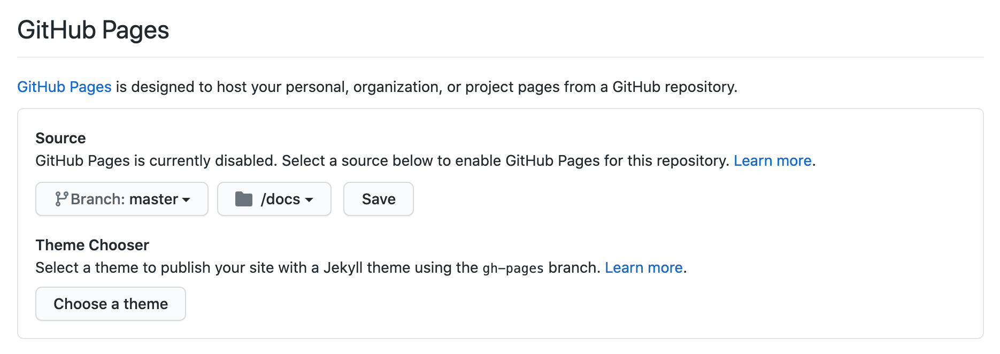
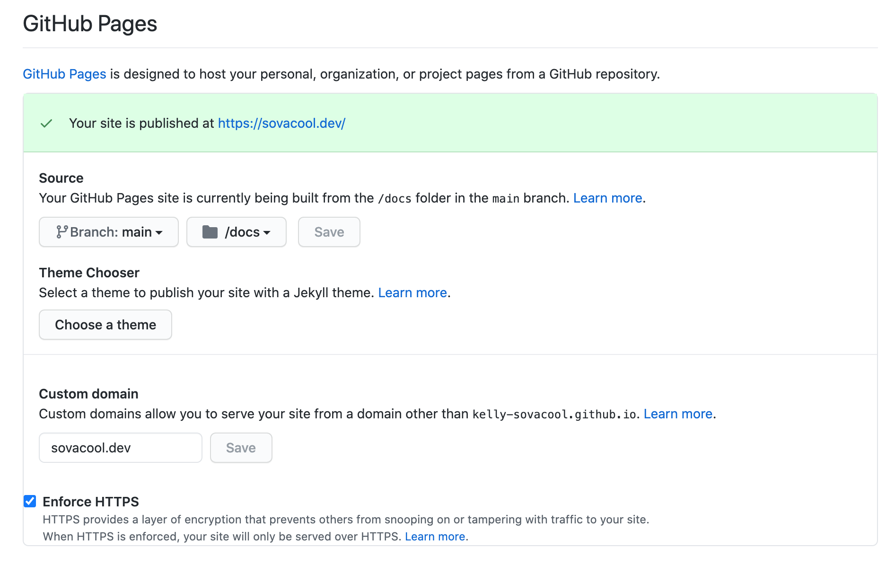

<!-- README.md is generated from README.Rmd. Please edit that file -->

```{r, include = FALSE}
knitr::opts_chunk$set(
  collapse = TRUE,
  comment = "#>"
)
```

# gh-tips

<!-- badges: start -->
<!-- badges: end -->
Tips & tricks for making the most of GitHub

Contents:

- [GitHub Pages](#github-pages)
- [GitHub Actions](#github-actions)
- [More Ideas?](#more-ideas)

## GitHub Pages

Host static web pages for free!

### Getting started

1. In the repository settings, scroll down to the GitHub Pages heading. Under source, select the default branch (e.g. `master` or `main`) and select the `/docs` folder. Then click the `Save` button.
  
1. Put your HTML or markdown files in `/docs`.
1. Your webpages will appear at `https://your-username.github.io/repo-name/filename.html`.

#### Initial tips

- Pat has a custom domain set up for the lab, so pages from repos in the `SchlossLab` GitHub Organization appear at `http://www.schlosslab.org/repo-name`.
  - e.g. the mikropml documentation appears at <http://www.schlosslab.org/mikropml/>, and
  the source files are in [the `/docs` folder of `SchlossLab/mikropml`](https://github.com/SchlossLab/mikropml/tree/master/docs).
- In settings, choose a theme, then plain markdown (`.md`) files will automatically be styled and rendered to HTML. GitHub stores your theme setting in `/docs/_config.yml`.
- Create a file called `index.md` inside `/docs`, and it will appear as the landing page at `https://your-username.github.io/repo-name`. (Must first choose a theme for `.md` to render properly.)
  - e.g. [docs/index.md](https://github.com/SchlossLab/gh-tips/blob/master/docs/index.md) and <http://SchlossLab.github.io/gh-tips/>
- To make a personal website, the repo must be named `your-username.github.io`. 
  - Here's mine: <https://github.com/kelly-sovacool/kelly-sovacool.github.io>
  - If you own a custom domain, you can use it!
    
- Warning: the rendered web page will be **public** even if your repository is **private**. 

### Viewing HTML files created with R Markdown

Currently, GitHub shows HTML files in your repository in plain text.
That makes sense if you're a web developer and need to edit HTML manually.
But if you're rendering an R Markdown document to an HTML format, chances are
you would much rather view the HTML in its prettier rendered form.

When you render an R Markdown file, use the option `output_dir = "docs"` if you
selected the `/docs` directory as your webpage source. 
Example:

```{r, eval = FALSE}
rmarkdown::render('reports/report.Rmd', output_dir = 'docs')
```
- The R Markdown source is `reports/report.Rmd`.
- The HTML source (rendered from R Markdown) is `docs/report.html`.
- The rendered HTML appears at <http://www.schlosslab.org/gh-tips/report.html>.

### Sharing slides for presentations

When using the `xaringan` package to make slides with R Markdown:

- Put the R Markdown file in the same directory as the output HTML.
- Knit from the document directory (select the arrow to the right of the knit button).
- Set `self-contained: true` so the HTML output files will contain everything needed to render (including images).

Example:

- R Markdown Source: `docs/slides/example-slides.Rmd`
- HTML Output: `docs/slides/example-slides.html`
- Rendered HTML: <http://www.schlosslab.org/gh-tips/slides/example-slides.html>

## GitHub Actions

Do things like run unit tests, render R Markdown documents, and more 
✨ _automagically_ ✨

All you need is a GitHub repo! 
Every workflow is a YAML file in `.github/workflows/`,
and GitHub will automatically run the jobs in the workflow depending on rules you specify.

### [Quickstart](https://docs.github.com/en/actions/quickstart)

1. Create [`.github/workfows/demo.yml`](.github/workfows/demo.yml):

    ``` yaml
    name: GitHub Actions Demo
    on: [push]
    jobs:
      Explore-GitHub-Actions:
        runs-on: ubuntu-latest
        steps:
          - run: echo "🎉 The job was automatically triggered by a ${{ github.event_name }} event."
          - run: echo "🐧 This job is now running on a ${{ runner.os }} server hosted by GitHub!"
          - run: echo "🔎 The name of your branch is ${{ github.ref }} and your repository is ${{ github.repository }}."
          - name: Check out repository code
            uses: actions/checkout@v2
          - run: echo "💡 The ${{ github.repository }} repository has been cloned to the runner."
          - run: echo "🖥️ The workflow is now ready to test your code on the runner."
          - name: List files in the repository
            run: |
              ls ${{ github.workspace }}
          - run: echo "🍏 This job's status is ${{ job.status }}."
    ```

1. Add, commit, & push it to GitHub.

    ``` sh
    git add .github/workflows/demo.yml
    git commit -m "Create GitHub Actions demo"
    git push
    ```

1. Wait for the workflow to run and take a look at the results under the [Actions tab](https://github.com/SchlossLab/gh-tips/actions).

### Triggering workflows to run

- When a commit is pushed to any branch.
  ``` YAML
  on: push
  ```
- When a commit is pushed to a particular branch or branches.
  ``` YAML
  on: 
    push:
      branches:
        - main
        - another-branch-name
  ```
- When a commit is pushed to a Pull Request against a particular branch.
  ``` YAML
  on: 
    pull_request:
      branches:
        - main
  ```
- When certain files are modified.
  ``` YAML
  on: 
    push:
      paths:
        - *.R
        - *.Rmd
        - *.py
  ```
- On a [schedule](https://docs.github.com/en/actions/learn-github-actions/events-that-trigger-workflows#schedule) (a.k.a. a cron job).
  ``` YAML
  on:
    schedule:
      - cron:  '0 0 * * 1' # every monday at midnight
  ```

### Examples

1. [Reformat your code on every push](https://github.com/SchlossLab/Sovacool_OptiFit_2021/blob/main/.github/workflows/build.yml).
1. [Check that an R package still works for every OS & the last 3 R versions](https://github.com/SchlossLab/mikropml/blob/main/.github/workflows/check.yml).
1. [Render package documentation on every Pull Request](https://github.com/SchlossLab/mikropml/blob/main/.github/workflows/pr_build.yml).
1. [Compile a JOSS/JOSE paper.md as a PDF and upload as an _artifact_](https://github.com/UMCarpentries/intro-curriculum-r/blob/gh-pages/.github/workflows/draft-pdf.yml).
1. [Render an R Markdown document every Monday at 5am](https://github.com/kelly-sovacool/pkg-downloads/blob/main/.github/workflows/render-rmarkdown.yaml).

### Actions tips

1. You can only have one workflow that pushes commits to your repo.
1. Use [crontab guru](https://crontab.guru/) to make sure your cron schedule does what you think it does.
1. There's a monthly wall time limit for private repos, but there's no limit for public repos.

### More Resources on GitHub Actions

- The GitHub Docs: https://docs.github.com/en/actions
- Actions for R by RStudio: https://github.com/r-lib/actions

## Badges

TODO

## More Ideas?

Open an Issue or submit a Pull Request on this repository!